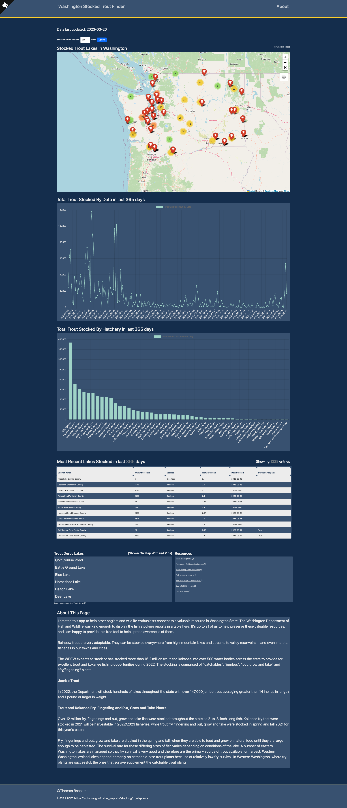

# Washington Trout Stats

**Authors:** Thomas Basham

**Version:** 3.1.2

[washington-trout-stats.vercel.app](https://washington-trout-stats.vercel.app)

**A web application used for displaying the most recent lakes that were stocked with trout in Washington State on an interactive map and charts.**

## Problem Domain

The [Washington Department of Fish and Wildlife Trout Stock Report](https://wdfw.wa.gov/fishing/reports/stocking/trout-plants) is excellent if you want to view data from clunky tables with endless amounts of pages to click through. That equates to one request for each page click, multiplied by an unanticipated amount of users, creates an unnecessary amount of web traffic that inevitably costs we the taxpayers more money. What if we had all of this data in one place, where a single computer could connect to the [WDFW Stock Report](https://wdfw.wa.gov/fishing/reports/stocking/trout-plants) each day and provide all of the data they need in one convenient page, offloading the WDFW's bandwidth at the same time?

That's why I created Washington Trout Stats, to make this public data that anglers pay for by buying fishing licenses more easily accessible. All of the data that you see in the WDFW stock reports page gets scraped and stored in a cloud database. This app also functions as an API that serves the data in JSON format, creating endless opportunities for mobile and desktop apps in the future.

## Tech Used

- Flask

- Beautiful Soup (Data scraped from [WDFW Stock Report](https://wdfw.wa.gov/fishing/reports/stocking/trout-plants))

- Folium

- SQLAlchemy

- PostgreSQL Database

- [GitHub Cron Job](https://github.com/Thomas-Basham/washington-trout-stats/actions/workflows/cron.yaml) (To schedule webscraping daily)

- Google Geolocation API (To get lat/lon of lakes)

- Docker

## [Get started Contributing](./CONTRIBUTING.md)

## Resources

[WDFW Stock Report](https://wdfw.wa.gov/fishing/reports/stocking/trout-plants)

[Flask](https://flask.palletsprojects.com/)

[Beautiful Soup](https://www.crummy.com/software/BeautifulSoup/bs4/doc/)

[SQLAlchemy](https://flask-sqlalchemy.palletsprojects.com/en/2.x/quickstart/)

[Docker and NGINX](https://github.com/docker/awesome-compose/tree/master/nginx-wsgi-flask)

[Google Geolocator API](https://developers.google.com/maps/documentation/geolocation/overview)

