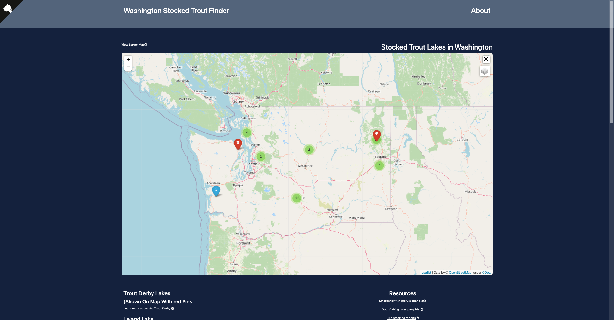
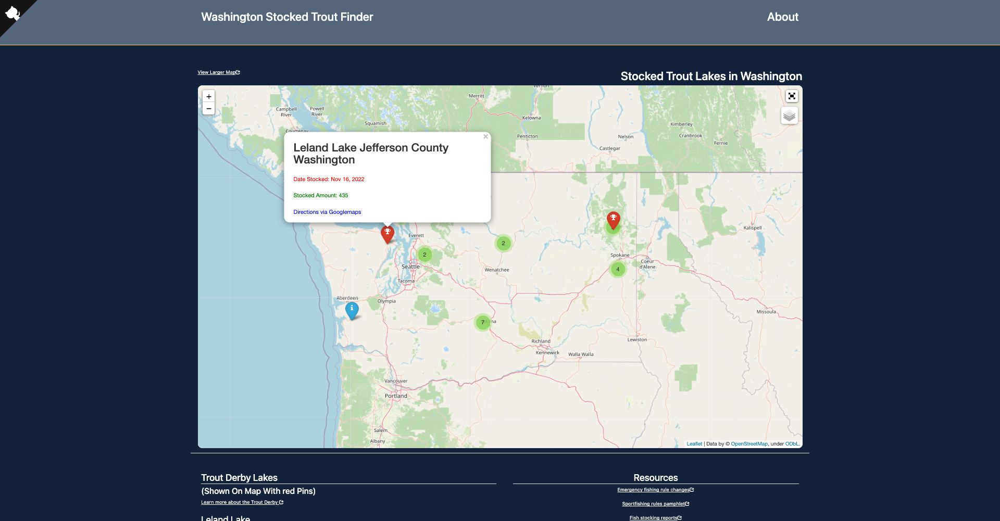
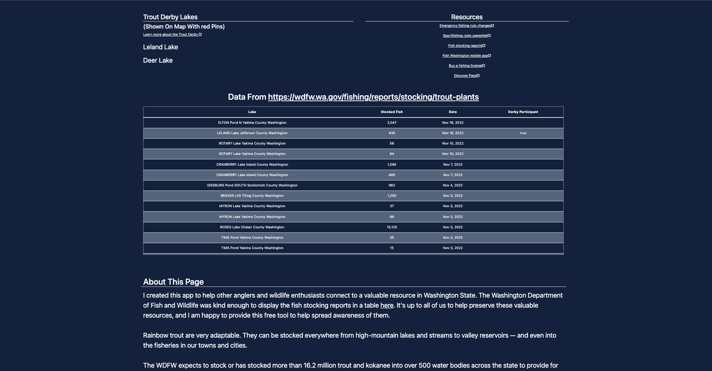
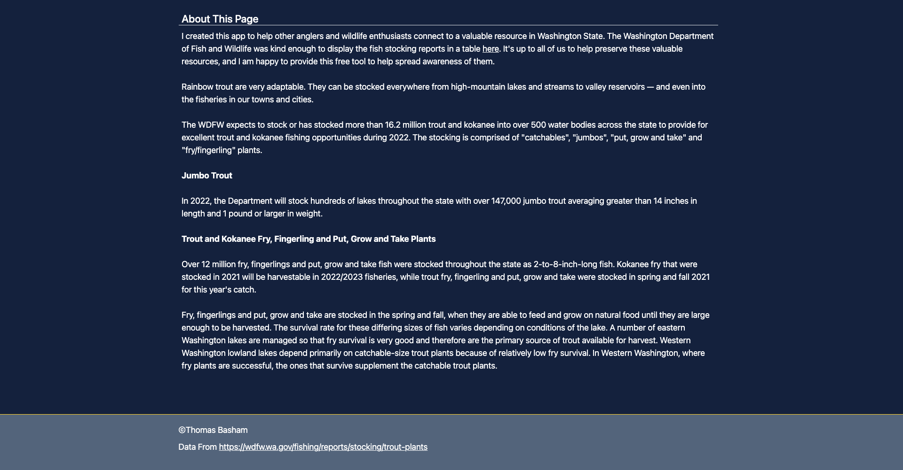
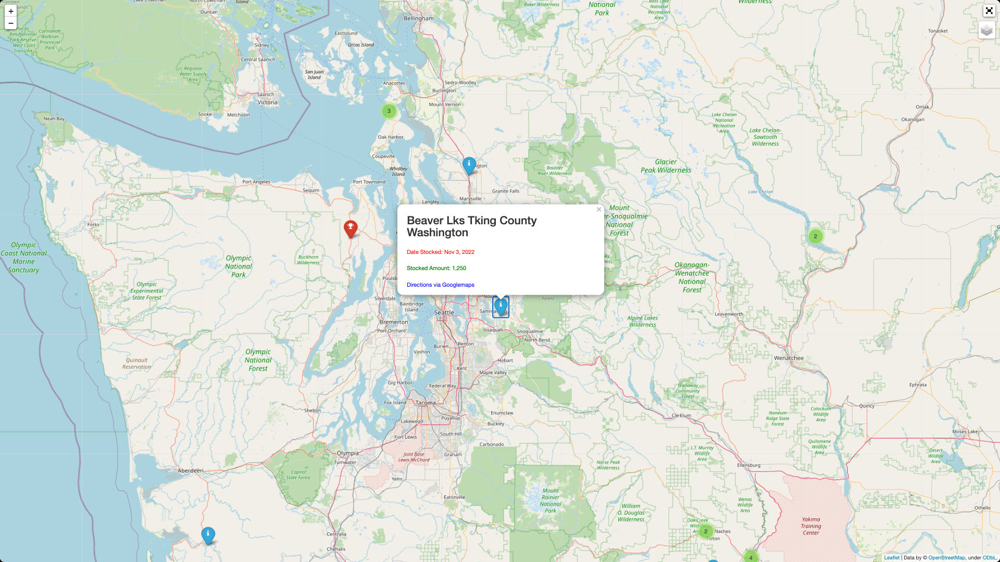

# Trout Finder

**Author:** Thomas Basham

[trout-finder.vercel.app](https://trout-finder.vercel.app)

A Flask Web App used for displaying the most recent lakes that were stocked with trout in Washington State on an interactive map

## Tech Used 

* Flask

* Beautiful Soup (Data scraped from [WDFW Stock Report](https://wdfw.wa.gov/fishing/reports/stocking/trout-plants))

* Folium

* SQLAlchemy

* Postgres Database

* Cron Job(To schedule webscraping daily)

* Google V3 Geolocator(To get lat/lon of lakes)

## Resources
[WDFW Stock Report](https://wdfw.wa.gov/fishing/reports/stocking/trout-plants)

[SqAlchemy](https://flask-sqlalchemy.palletsprojects.com/en/2.x/quickstart/)

[Pandas to SQL](https://towardsdatascience.com/upload-your-pandas-dataframe-to-your-database-10x-faster-eb6dc6609ddf)

